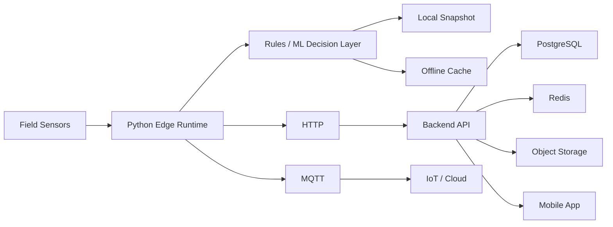

# CULTIVA+

> **Public project showcase.** The implementation remains private while this repository documents the architecture and engineering scope.

## Overview

**CULTIVA+** is a smart-agriculture platform combining **IoT sensing, edge intelligence, machine-learning-assisted irrigation decisions and mobile/cloud services**.

The project is divided into two complementary layers:

1. **Native / Edge** — field acquisition, local decisions, offline resilience and cloud publishing.
2. **Application Platform** — backend services, persistence, cache/object storage and mobile access.

## Edge Capabilities

- Real or simulated 7-in-1 sensor acquisition
- Irrigation recommendations using rules / ML
- Local JSON and CSV persistence
- Latest-state snapshots
- Offline queue when connectivity is unavailable
- HTTP ingestion
- MQTT publishing
- LAN-accessible local API
- Dataset ETL
- Local model training

## Application Platform

- Mobile application
- Backend API
- PostgreSQL persistence
- Redis
- S3-compatible object storage

## Architecture

## Technology

| Area | Technologies |
|---|---|
| Edge | Python |
| IoT | MQTT · AWS IoT integration path |
| Intelligence | Rules · Machine Learning |
| Backend | NestJS · Prisma |
| Database | PostgreSQL |
| Cache | Redis |
| Object Storage | MinIO / S3-compatible |
| Mobile | Expo · React Native |
| Data | JSONL · CSV · ETL workflows |

## Engineering Highlights

### Offline Resilience

The edge module can keep local data when connectivity is unavailable instead of assuming a permanent cloud connection.

### Sensor-to-Decision Pipeline

Sensor acquisition, data persistence and irrigation recommendations are organized as a single technical pipeline.

### Multiple Communication Modes

The architecture supports both HTTP and MQTT-based integration.

### Data Preparation

The project includes ETL workflows that transform local/raw agricultural data into curated datasets used for training and decisions.

### Edge + Application Separation

Field intelligence and application services are kept as separate layers, allowing the system to continue useful local operation independently of the mobile/backend stack.

## Repository Strategy

Device credentials, environment configuration and implementation code remain private. This repository exposes only a portfolio-safe description of the platform.

---

**Private source repository · Public smart-agriculture case study**
