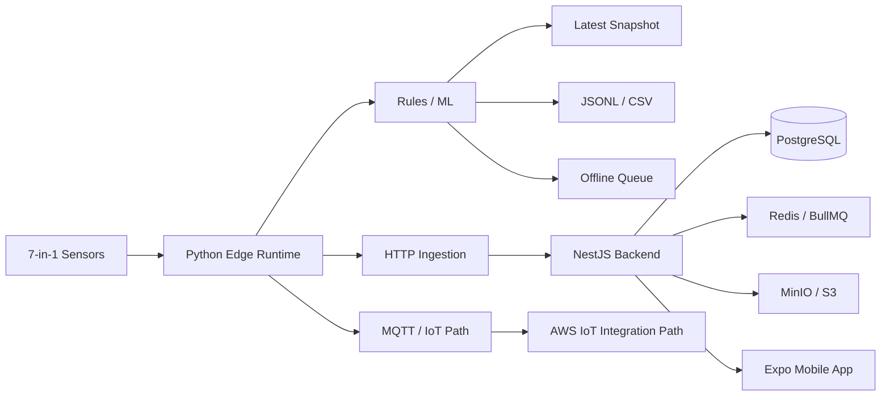

# CULTIVA+

### Smart Agriculture · IoT · Edge Intelligence · Mobile

**Public engineering showcase — source code remains private**

[Architecture](./docs/ARCHITECTURE.md) · [Project status](./docs/STATUS.md)

---

## Overview

**CULTIVA+** is a smart-agriculture project that combines field sensing, local/edge processing, irrigation recommendations and a mobile/backend application layer.

The private repository is split into two major areas:

1. **Native / Edge** — Python-based sensing, local persistence, decision logic and connectivity.
2. **Application Platform** — NestJS backend plus Expo/React Native mobile client.

The edge module is explicitly described in the private project as **pre-MVP**, so this showcase focuses on architecture and implemented building blocks rather than presenting the system as production-ready.

## Edge / IoT Pipeline

## Edge Capabilities Present in the Private Project

- real or simulated 7-in-1 sensor reads
- irrigation recommendations using rules / ML
- JSONL and CSV persistence
- latest-state snapshot
- offline cache when connectivity is unavailable
- HTTP publishing
- MQTT / IoT Core integration path
- local LAN snapshot API
- dataset ETL
- local model-training workflow

## Application Platform

The private application layer contains:

### Backend

- NestJS
- Prisma
- PostgreSQL
- Redis / BullMQ
- Socket.IO
- JWT / Passport
- S3-compatible storage integration
- Swagger
- health/metrics-related tooling
- validation, rate limiting and Helmet

### Mobile

- Expo / React Native
- navigation
- Axios
- SecureStore
- notifications
- location
- Google sign-in integration path
- Socket.IO client
- Zod

## Technology

| Area | Technologies |
|---|---|
| Edge | Python |
| IoT | MQTT · AWS IoT integration path |
| Intelligence | Rules · ML workflows |
| Backend | NestJS · Prisma |
| Database | PostgreSQL |
| Queue/cache | Redis · BullMQ |
| Realtime | Socket.IO |
| Storage | MinIO · S3-compatible |
| Mobile | Expo · React Native |
| Data preparation | JSONL · CSV · ETL |

## Engineering Decisions

**Offline operation matters.** The edge layer caches data locally instead of assuming reliable connectivity.

**Field intelligence is separated from the application backend.** Sensor acquisition and recommendations can evolve independently from the mobile/product layer.

**Multiple transport options are supported.** HTTP and MQTT serve different connectivity scenarios.

**Data preparation is part of the system.** ETL and model-training utilities are kept alongside the edge workflow instead of being treated as unrelated notebooks.

## Current Status

The private native module is explicitly **pre-MVP**. Core edge building blocks and application-layer foundations exist, while hardware/cloud integration and product validation still require further work.

[See the explicit status matrix →](./docs/STATUS.md)

## Why the Source Is Private

The implementation contains device/environment configuration, integration contracts and product code that should not be exposed through a public portfolio.

---

### What this project demonstrates

**IoT architecture · edge resilience · smart agriculture · ML-assisted decisions · backend/mobile integration · offline-first thinking**
