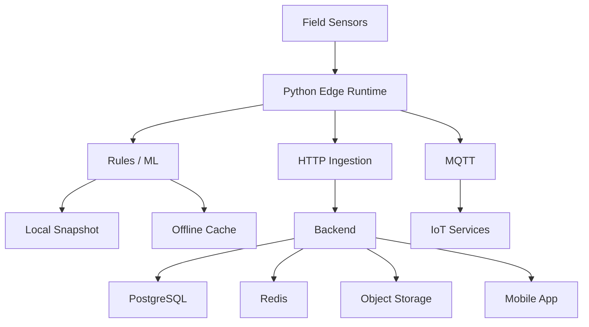

# CULTIVA+ — Architecture Notes

## Product Layers

1. **Sensor Layer** — raw agricultural measurements.
2. **Edge Runtime** — local acquisition, processing and persistence.
3. **Decision Layer** — rules / ML-assisted irrigation recommendations.
4. **Connectivity Layer** — HTTP and MQTT.
5. **Application Platform** — backend, storage and mobile client.

## Logical Flow

## Design Considerations

- Edge operation remains useful without permanent cloud connectivity.
- Data persistence and offline queues protect against intermittent networks.
- HTTP and MQTT provide alternative integration patterns.
- Dataset preparation and training are separated from field runtime.
